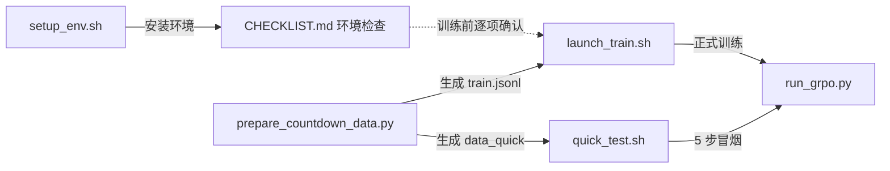

## 用户需求

为已有 GRPO 训练项目编写 4 个运行配套文件，均需详细中文注释、良好错误处理：

1. **scripts/launch_train.sh** — 训练启动脚本：

- 自动检测可用 GPU 数量，自动计算 `num_processes = GPU 数 - 1`（最后 1 卡留给 vLLM）
- 支持参数选择 recipe 配置文件（默认全参数配置 `recipes/grpo-qwen-2.5-3b-countdown.yaml`，配合默认 accelerate 配置 `configs/accelerate_configs/deepspeed_zero3.yaml`）
- 支持参数选择 full / qlora 模式
- 组装并执行完整的 `accelerate launch` 命令
- GPU 数量不足（<=1，无法同时满足训练+vLLM）时给出明确报错提示

2. **scripts/quick_test.sh** — 快速验证脚本：

- 自动生成 10 条极小数据集
- `max_steps=5` 快速跑通全流程
- 训练结束后输出每步 loss 和 reward 值
- 校验输出目录与模型产物是否生成

3. **docs/CHECKLIST.md** — 运行检查清单：

- 硬件检查项（GPU 型号、显存、NVLink 状态）
- 软件环境检查项（依赖版本、CUDA 版本、DeepSpeed 编译状态）
- 数据检查项（完整性、格式正确性）
- 训练前检查项（配置参数合理性、模型加载测试）
- 常见问题排查表（ZeRO 显存不足、vLLM 推理超时、loss 发散、reward 异常等）
- 每个检查项必须给出具体检查命令与预期结果

4. **scripts/setup_env.sh** — 一键环境安装脚本：

- 创建 conda 环境（Python 3.10）
- 按集群 CUDA 版本安装 torch，再安装其余指定版本依赖
- 可选从源码安装 trl（支持 Liger GRPO Loss）
- 配置 HuggingFace 镜像源（国内加速）
- 安装完成后打印各库版本验证

## 补充约束

- 脚本目标运行环境为 Linux GPU 集群（bash）；本地为 Windows，无法实际执行，仅做静态验证
- 与现有代码严格对齐：`run_grpo.py` CLI（--config/--mode/--train_file/--max_steps/--logging_steps/--output_dir/--report_to）、`prepare_countdown_data.py` CLI（--max_samples/--output_dir/--seed）、两个 recipes 文件名、accelerate 配置文件路径
- 保持既有约定：num_processes = GPU 数 - 1，vLLM 自动占用最后一块空闲卡

## 技术栈

- Shell 脚本：bash（set -euo pipefail），面向 Linux GPU 集群；脚本目标环境需 conda、nvidia-smi、accelerate
- 文档：Markdown（docs/CHECKLIST.md）
- 与现有 Python 脚本（run_grpo.py / prepare_countdown_data.py / reward_functions.py）与 YAML 配置（configs/accelerate_configs/deepspeed_zero3.yaml、recipes/*.yaml）严格衔接

## 实现方案

### 1. scripts/setup_env.sh（环境安装，最先编写）

- **参数**：`--env-name`（默认 grpo）、`--python`（默认 3.10）、`--cuda`（cu121/cu124/cu128，默认由 `nvidia-smi` 驱动 CUDA 版本自动推断）、`--source-trl`（flag，从源码安装 trl 以启用 Liger GRPO Loss）、`--hf-endpoint`（默认 https://hf-mirror.com）、`--skip-verify`
- **流程**：检查 conda → `conda create -y` 建环境 → `source "$(conda info --base)/etc/profile.d/conda.sh"` + `conda activate`（非交互 shell 正确激活）→ 按 CUDA 版本安装 torch（`--index-url https://download.pytorch.org/whl/cuXXX`；CUDA 12.8 追加 vllm 的 `--extra-index-url`）→ `pip install -r requirements.txt` → 可选 `git clone --depth 1` trl 官方仓库并 `pip install -e ".[liger]"` → 配置 `HF_ENDPOINT`（grep 幂等检查后追加到 ~/.bashrc）→ `pip check` + python 打印 torch/transformers/trl/accelerate/deepspeed/vllm/peft/bitsandbytes/datasets 版本 + `deepspeed --version` 验证
- **错误处理**：每步失败即退出并输出"失败原因 + 修复建议"的中文提示；依赖顺序遵循 requirements.txt 头部说明（先 torch 后 vllm 等）

### 2. scripts/launch_train.sh（正式启动）

- **参数**：`--recipe`（支持短名自动补全为 `recipes/<name>.yaml`，默认 `recipes/grpo-qwen-2.5-3b-countdown.yaml`）、`--mode {full,qlora,auto}`（默认 auto，即不传 --mode 由 run_grpo.py 按 load_in_4bit 推断）、`--accelerate-config`（默认 configs/accelerate_configs/deepspeed_zero3.yaml）、`--num-gpus`（可选手动指定，默认自动检测）、其余 `"$@"` 原样透传给 run_grpo.py（如 --learning_rate/--output_dir）
- **流程**：检测 `nvidia-smi` 存在 → `nvidia-smi --query-gpu=index --format=csv,noheader | wc -l` 得 GPU 数 → 校验 GPU 数 >= 2（<2 报错：至少 1 训练卡 + 1 vLLM 卡）→ `NUM_PROCESSES=$((GPU_COUNT-1))` → 校验 recipe / accelerate 配置 / data/train.jsonl 存在（缺失时提示先运行 prepare 脚本）→ 打印完整 accelerate launch 命令（便于复现）→ 执行并透传退出码
- **错误处理**：文件缺失、命令不存在均给出具体修复指引

### 3. scripts/quick_test.sh（快速验证）

- **流程**：GPU 检测（>=2，逻辑同 launch_train）→ `python scripts/prepare_countdown_data.py --max_samples 10 --output_dir data_quick --seed 42` 生成小数据集 → `accelerate launch --config_file <deepspeed_zero3> --num_processes $(GPU-1) scripts/run_grpo.py --config <默认 qlora recipe，可用 --recipe 覆盖> --train_file data_quick/train.jsonl --max_steps 5 --logging_steps 1 --save_steps 5 --output_dir output/quick_test --report_to tensorboard`，stdout+stderr 同时写入 `output/quick_test/train_log.txt` → 训练结束后检查 output/quick_test 与模型产物（config.json / adapter_model.safetensors）→ `grep -E "loss|reward"` 从日志提取每步 loss/reward 并打印摘要 → 清理提示（data_quick 可手动删除）
- **参数**：`--recipe`、`--mode`、`--num-gpus` 可覆盖默认（默认 qlora 模式省显存，10 条样本 5 步分钟级完成）

### 4. docs/CHECKLIST.md（检查清单）

- **文档结构**：使用说明 → ① 硬件检查（GPU 型号/数量/显存：`nvidia-smi --query-gpu=name,memory.total,memory.free --format=csv`；NVLink：`nvidia-smi topo -m` / `nvidia-smi nvlink -s`；内存 `free -h`；磁盘 `df -h`）→ ② 软件环境（驱动 CUDA：`nvidia-smi` 尾部；Toolkit：`nvcc --version`；Python 版本；一键打印各库版本命令；DeepSpeed 编译状态：`deepspeed --version` + `ds_report` 查看 JIT/AOT ops；`pip check`；Liger 可用性：`python -c "from trl import LigerGRPOConfig"`；HF 镜像：`echo $HF_ENDPOINT`）→ ③ 数据检查（行数 `wc -l`；首行 JSON 校验 `head -1 | python -m json.tool`；字段缺失统计脚本；奖励函数自测 `python scripts/reward_functions.py`；target 数值抽样）→ ④ 训练前检查（recipe 关键参数核对表与查看命令；模型+tokenizer 加载冒烟测试命令；`accelerate env`；输出目录可写）→ ⑤ 常见问题排查表（Markdown 表格：ZeRO OOM、vLLM 超时/端口冲突/显存、loss 发散、reward 全 0 或 NaN、checkpoint 无法加载、GLIBC/CUDA 版本、多机连接）
- **每项均含"检查命令"与"预期结果/处理方式"两列**，命令与脚本实际用法保持一致

## 架构与文件关系



- 四个文件相互独立、职责清晰：setup_env.sh 负责"装环境"，CHECKLIST.md 负责"查环境/排错"，launch_train.sh 负责"正式跑"，quick_test.sh 负责"先跑通"
- 均以现有 run_grpo.py / prepare_countdown_data.py 的 CLI 契约为准，不修改任何现有文件

## 目录结构

```
deepspeed+trl分布式/
├── docs/
│   └── CHECKLIST.md                # [NEW] 运行检查清单（硬件/软件/数据/训练前/问题排查）
├── scripts/
│   ├── setup_env.sh                # [NEW] 一键环境安装（conda + 按 CUDA 装 torch + 可选源码 trl + HF 镜像 + 版本验证）
│   ├── launch_train.sh             # [NEW] 训练启动（GPU 检测 + num_processes=GPU-1 + recipe/mode 选择 + 完整 accelerate 命令）
│   └── quick_test.sh               # [NEW] 快速验证（10 条数据 + max_steps=5 + loss/reward 输出 + 产物检查）
└── （其余文件不变：scripts/*.py、configs/、recipes/、requirements.txt、README.md）
```

## 实现注意

- 所有脚本 `set -euo pipefail` 并逐段输出中文进度提示；launch_train.sh / quick_test.sh 在 GPU < 2 时给出"需预留 1 卡给 vLLM"的明确提示并退出
- quick_test.sh 默认使用 QLoRA recipe（显存占用小、验证快），并允许 `--mode full` 覆盖
- setup_env.sh 的 HF_ENDPOINT 写入采用 grep 幂等追加，避免重复执行时产生重复行
- 不修改 requirements.txt / run_grpo.py / recipes；脚本引用的文件路径与 CLI 参数名逐一核对现有实现
- 本地 Windows 无法运行 bash：验证方式为 `bash -n`（若本机有 git-bash/WSL 则执行）语法检查 + 脚本内文件路径与 CLI 参数与现有代码的静态一致性检查