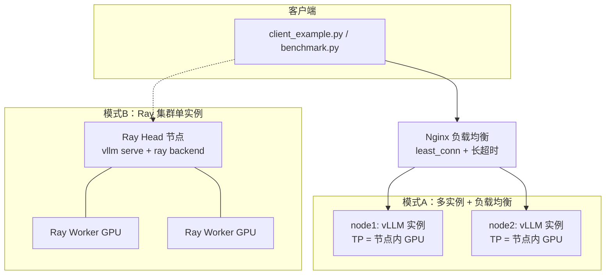

## 产品概述

为项目新增**多机 vLLM 推理服务部署**能力。当前 vLLM 仅作为 GRPOTrainer 内嵌的 rollout 引擎（训练时占用最后一张空闲卡），没有任何独立推理服务。本次补充一套 Docker 化的生产部署方案，把训练产物（或任意 HF 模型）以 OpenAI 兼容 API 的形式对外提供服务，并覆盖两种多机架构、容器编排、健康检查、客户端调用与压测。

## 核心功能

- **两种多机架构，脚本模式切换**
  - 模式 A（多实例 + 负载均衡）：每节点独立 vLLM 实例（TP 取节点内 GPU 数），Nginx 统一入口分发，并发吞吐最高，3B 模型生产首选
  - 模式 B（Ray 集群单实例跨节点 TP/PP）：一个 vLLM 实例跨节点并行，统一入口，适用于单节点显存装不下的大模型
- **Docker 化交付**：Dockerfile + 三套 compose（单机验证 / 多机多实例 / Ray 集群），模型目录挂载复用，避免重复下载
- **模型来源参数化**：支持 HF repo id 或本地目录，可直接部署 SFT / GRPO 训练产物，不硬编码模型
- **配套工具**：OpenAI 兼容客户端示例（含流式与并发）、压测脚本（吞吐 / TTFT / P99）、多节点健康检查脚本
- **文档说明**：README 新增完整部署章节（架构对比、构建、启动、调用、压测、排障），`deploy/README.md` 作为模块说明


## 技术栈选型

沿用项目既有栈并新增部署组件，**训练链路零改动**：

| 组件 | 版本 / 说明 | 用途 |
|---|---|---|
| vLLM | >= 0.8.0（与 `requirements.txt` 一致） | OpenAI 兼容推理服务，`vllm serve` 启动 |
| Docker / Compose | Docker 20.10+、Compose v2 | 容器化编排，`deploy.resources.reservations.devices` 申请 GPU |
| vLLM 官方镜像 | `vllm/vllm-openai`（ARG 指定版本） | 基础镜像，已含 CUDA / vLLM 依赖 |
| Ray | 随官方镜像 | 模式 B 的多节点分布式执行后端 |
| Nginx | 官方镜像 | 模式 A 的负载均衡网关 |
| Python 客户端 | openai / aiohttp + requests | 客户端示例与并发压测 |

## 实现方案

**核心策略**："独立模块、参数驱动、模式切换"——部署资产全部集中在 `deploy/`，与训练脚本物理隔离；模型路径、并行度、节点列表、端口等全部由 `.env` 或命令行参数驱动；`start_vllm.sh` 作为容器统一入口，按 `MODE` 变量分发到模式 A / 模式 B 的启动逻辑。

**命令要点**（vLLM 0.8.x）：

- 模式 A 单节点实例：`vllm serve <model> --tensor-parallel-size <节点内GPU数> --host 0.0.0.0 --port 8000 --served-model-name <name>`
- 模式 B Ray 集群：head 节点 `ray start --head --port=6379`，worker 节点 `ray start --address=<head_ip>:6379`，
  vLLM 侧增加 `--distributed-executor-backend ray`、`--pipeline-parallel-size`（跨节点），约束 `TP × PP = 总 GPU 数`
- OpenAI 兼容端点：`/v1/chat/completions`、`/v1/completions`、`/v1/models`、健康检查 `/health`

**架构设计**



## 实现注意事项

- **容器 GPU 与共享内存**：必须 `--gpus all`（compose 用 `devices` 预留）+ `ipc: host` + 放大 `shm_size`，否则 PyTorch 多进程共享内存不足会在加载模型阶段失败
- **Nginx 超时**：LLM 生成耗时长，`proxy_read_timeout` / `proxy_send_timeout` 需放大（建议 600s 以上），并关闭 `proxy_buffering` 以支持流式输出（SSE）
- **负载均衡策略**：默认 `least_conn`；若同一会话需粘滞可切 `ip_hash`
- **跨节点 TP 的网络要求**：模式 B 的跨节点张量并行对带宽敏感，以太网环境优先加大 `PP` 而非 `TP`；高速网络（IB/RoCE）下再考虑大 TP
- **模型挂载**：把 HF 缓存目录与训练产物目录挂载进容器（只读），避免在每台机器重复下载；国内环境用 `HF_ENDPOINT=https://hf-mirror.com`
- **版本一致性**：容器 vLLM 版本与 `requirements.txt` 的 `vllm>=0.8.0` 保持同一大版本，避免本地客户端与服务端行为不一致
- **行尾与语法**：所有 `.sh` 保持 LF 行尾并通过 `bash -n`；Python 脚本通过 `py_compile`；compose / nginx 配置做 YAML 与语法校验（本机无 Docker 时至少做 YAML 解析校验）
- **边界**：不修改 `run_grpo.py`、`recipes/`、`scripts/megatron/` 等既有文件

## 目录结构

```
deepspeed+trl分布式/
├── deploy/                                  # [NEW] 多机 vLLM 部署模块（独立，不影响训练链路）
│   ├── README.md                            # [NEW] 模块说明：两种架构、快速开始、参数表、排障
│   ├── Dockerfile                           # [NEW] 基于 vllm/vllm-openai 的镜像，ARG 指定版本，内置启动入口与健康检查
│   ├── .env.example                         # [NEW] 环境变量样例：模型路径、TP/PP、端口、节点列表、HF_ENDPOINT、GPU 显存占用
│   ├── docker-compose.yml                   # [NEW] 单机多卡快速验证（1 个 vLLM 实例 + Nginx）
│   ├── docker-compose.multinode.yml         # [NEW] 模式A：每节点 1 个 vLLM 实例（节点内 TP）+ Nginx 负载均衡
│   ├── docker-compose.ray.yml               # [NEW] 模式B：Ray head/worker + 单实例跨节点 TP/PP
│   ├── nginx/
│   │   ├── nginx.conf.template              # [NEW] upstream 模板（含 ${VLLM_UPSTREAM} 占位、长超时、流式支持）
│   │   └── nginx.conf                       # [NEW] 由模板 + 节点列表生成的实际配置（脚本自动生成）
│   ├── scripts/
│   │   ├── start_vllm.sh                    # [NEW] 容器统一入口：按 MODE 组装 vllm serve 命令（含 TP/PP/显存/最大长度等参数校验）
│   │   ├── deploy_multinode.sh              # [NEW] 多机部署：读取节点列表，ssh 分发配置并批量拉起 compose，生成 nginx upstream
│   │   ├── health_check.sh                  # [NEW] 健康检查：逐节点探测 /health 与 /v1/models、GPU 占用、容器状态、Nginx 入口
│   │   ├── stop_all.sh                      # [NEW] 一键停止与清理（多机，含是否清理容器/网络的可选参数）
│   │   └── gen_nginx_upstream.sh            # [NEW] 按节点列表渲染 nginx.conf（envsubst / sed，幂等）
│   ├── client_example.py                    # [NEW] OpenAI 兼容客户端：单次调用、流式输出、批量并发三种示例
│   └── benchmark.py                         # [NEW] 压测：并发数/请求数可调，统计吞吐 tok/s、TTFT、端到端 P50/P95/P99、错误率
├── README.md                                # [MODIFY] 新增「多机 vLLM 部署」章节（架构对比、构建、两种模式启动、调用、压测、排障）
└── project.md                               # [MODIFY] 按第 5.2 节模板追加 Loop 7（本次部署能力闭环）
```

## 关键代码结构

容器启动入口的核心命令组装（按模式分发，参数由环境变量注入）：

```bash
# 模式 A：单节点独立实例（节点内 TP）
vllm serve "${MODEL_PATH}" \
    --served-model-name "${SERVED_MODEL_NAME}" \
    --tensor-parallel-size "${TP}" \
    --gpu-memory-utilization "${GPU_MEM_UTIL}" \
    --max-model-len "${MAX_MODEL_LEN}" \
    --host 0.0.0.0 --port "${VLLM_PORT}"

# 模式 B：Ray 集群单实例（TP × PP = 集群总 GPU 数）
vllm serve "${MODEL_PATH}" \
    --served-model-name "${SERVED_MODEL_NAME}" \
    --tensor-parallel-size "${TP}" \
    --pipeline-parallel-size "${PP}" \
    --distributed-executor-backend ray \
    --host 0.0.0.0 --port "${VLLM_PORT}"
```

Nginx upstream 模板关键片段（长超时 + 关闭缓冲以支持流式）：

```nginx
upstream vllm_backend {
    least_conn;
    ${VLLM_UPSTREAM}
}
server {
    listen 8080;
    location / {
        proxy_pass http://vllm_backend;
        proxy_http_version 1.1;
        proxy_set_header Connection "";
        proxy_buffering off;          # 支持 SSE 流式输出
        proxy_read_timeout 600s;      # LLM 生成耗时较长
        proxy_send_timeout 600s;
    }
}
```

## 验证方式

- `bash -n` 校验全部 `.sh`（含容器内启动脚本）
- `python -m py_compile` 校验 `client_example.py` / `benchmark.py`
- YAML 解析校验 compose 文件；nginx 配置做占位符与括号配对检查
- 全部交付文件统一为 LF 行尾（注意：本仓库 `core.autocrlf=true`，写入后需显式规范化）
- 交叉核对：compose 内挂载路径、脚本引用的相对路径与 README 示例命令一致

