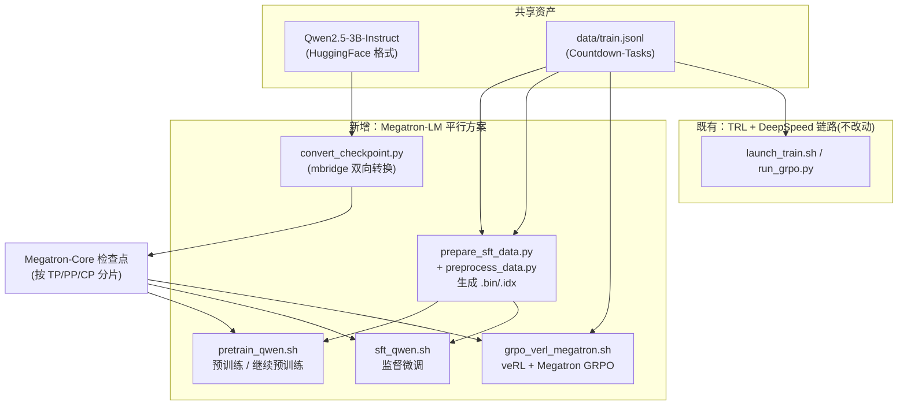

## 用户需求

在现有 **DeepSpeed + TRL (GRPO)** 分布式训练项目基础上，新增 **Megatron-LM 多卡分布式训练方法**。经澄清确认，交付范围为最完整形态：

1. **交付形态**：文档 + 脚本 + 环境集成——新增 Megatron 专属依赖清单、`scripts/` 与 `configs/` 下可执行脚本与参数配置，并让 `scripts/setup_env.sh` 支持一键安装 Megatron-LM 依赖（含 TransformerEngine 等编译组件）
2. **训练场景**：覆盖**预训练/继续预训练**、**SFT 监督微调**、**GRPO 强化学习**（引入 veRL 框架的 Megatron 后端）
3. **格式转换**：必须包含权重与数据两方面的转换能力——`Qwen/Qwen2.5-3B-Instruct` 由 HuggingFace 格式转 Megatron 检查点（双向）、`jsonl` 数据转 Megatron 二进制索引（`.bin`/`.idx`）格式，含命令与注意事项

## 产品概述

在不破坏现有 TRL/DeepSpeed GRPO 链路的前提下，以**平行新增方案**的形式，为项目补齐 Megatron-LM 的 3D/5D 并行训练能力（TP 张量并行、PP 流水线并行、CP 上下文并行、DP 数据并行、EP 专家并行 + 序列并行），使同一份 Countdown-Tasks 数据与 Qwen2.5-3B 模型可分别走"TRL+DeepSpeed"与"Megatron-LM（预训练/SFT/veRL-GRPO）"两条训练路径，形成可对照、可复现的工程体系。

## 核心功能

- **环境一键安装**：`setup_env.sh --with-megatron`，含 torch 版本校验、编译并发控制、安装后版本验证
- **权重双向转换**：基于 mbridge 的 HF ↔ Megatron-Core 检查点导入/导出，支持按 TP/PP/CP/VPP 分片
- **Megatron 数据预处理**：项目 `jsonl`（prompt/target/solution）转 Megatron 所需格式，并调用官方 `preprocess_data.py` 生成 `.bin`/`.idx` 二进制索引
- **预训练与 SFT 启动脚本**：`torchrun`/`deepspeed` 两种 launcher，3D/4D 并行参数可按卡数自动推荐组合
- **veRL + Megatron 的 GRPO**：通过 veRL Megatron 后端实现 5D 并行强化学习，含 Megatron↔vLLM 权重重分片与 offload 选项
- **文档体系**：README 新增完整章节（并行策略矩阵图、安装、数据、转换、三场景命令、FAQ），CHECKLIST 补充检查项与排查条目，project.md 追加 Loop 6 记录本次闭环

## 技术栈选型

沿用项目现有栈并新增 Megatron 生态，**主链路零改动**：

| 组件 | 版本/说明 | 用途 |
| --- | --- | --- |
| Python | >= 3.10（Megatron 推荐 3.12） | 沿用 `setup_env.sh` 现有 `--python` |
| PyTorch | **>= 2.6.0**（Megatron Core 硬性要求） | 与现有 `requirements.txt` 的 torch>=2.5.0 存在冲突，须显式处理 |
| megatron-core | 最新 PyPI 稳定版 | 3D/5D 并行训练核心；`[training]` extras 含 sentencepiece/wandb/transformers |
| TransformerEngine | 随 `[dev]` extras 编译（需 `--no-build-isolation`） | FP8/bf16 加速算子；Hopper/Ada/Blackwell 支持 FP8 |
| mbridge | `pip install mbridge` | HF ↔ Megatron-Core 权重双向转换（veRL 官方采用） |
| verl | PyPI/GitHub 最新 | GRPO 训练，Megatron 后端启用 5D 并行 |
| uv | NVIDIA 官方推荐安装器 | 替代裸 pip，加速依赖解析与安装 |


**冲突处理决策**：Megatron 依赖放入**独立的 `requirements-megatron.txt`**，不污染主 `requirements.txt`；`--with-megatron` 安装时先校验 `torch.__version__`，低于 2.6.0 时按集群 CUDA 版本升级 torch，并在文档与 CHECKLIST 中明示该冲突。

## 实施方案

**核心策略**："平行新增、物理隔离、契约对齐"——Megatron 全部资产集中在 `scripts/megatron/` 与 `configs/megatron/` 下，不修改任何现有训练脚本；脚本风格严格复用项目既有约定（`set -euo pipefail` + `log_info/log_ok/log_warn/die` 彩色日志 + 头部用法/参数注释块 + LF 行尾 + `bash -n` 验证），保证风格一致、可维护。

**三条训练链路设计**：

1. **预训练/继续预训练**：`pretrain_qwen.sh` → `torchrun` + Megatron-LM `pretrain_gpt.py`，TP/PP/CP 组合 + 序列并行；Qwen2.5-3B 架构参数（36 层 / hidden 2048 / 16 heads / GQA 2 kv-groups / vocab 151936 / ffn 11008 / RMSNorm+SwiGLU / RoPE theta 1e6）
2. **SFT**：`sft_qwen.sh` → 同一入口不同 `--train-mode finetune`（finetune + `--data-path` 指向 SFT 数据集），复用 `prepare_sft_data.py` 产出
3. **GRPO**：`grpo_verl_megatron.sh` → `python3 -m verl.trainer.main_ppo`，`algorithm.adv_estimator=grpo`，`actor_rollout_ref.actor.strategy=megatron`，并配置 `actor_rollout_ref.actor.megatron.{tensor,pipeline,context}_model_parallel_size`、offload 开关、 `MegatronVLLMShardingManager` 驱动的 rollout TP

**并行组合自动推荐**：脚本根据 `nvidia-smi` 检测到的 GPU 数给出 TP/PP/DP 组合建议（如 8 卡建议 TP2×PP2×DP2；单节点 NVLink 优先降 PP、增 DP），并校验 `world_size == TP × PP × CP × DP`，不满足立即 `die` 报错——这是新人最容易踩的错，前置校验能显著减少排查成本。

## 实施注意事项

- **编译控制**：安装含 TransformerEngine 的 extras 时**必须**设 `MAX_JOBS=4`（默认按 CPU 核数起任务，多核机器极易 OOM），并提示 20+ 分钟编译耗时；提供 `--megatron-lite`（`[training,lts]`）作为免编译降级路径
- **版本冲突显式化**：主 `requirements.txt` 为 torch>=2.5.0，Megatron 需 >=2.6.0；脚本执行前用 `python -c "import torch; ..."` 校验，文档与 CHECKLIST 均记录该项
- **转换前置依赖**：mbridge 依赖 `use_te=True`（官方注明 `use_te=False` 暂不支持），即转换前需 TransformerEngine 可用，须在步骤顺序上保证 TE 先装
- **veRL 版本差异**：`strategy=megatron` 等参数名在不同 verl 版本存在差异，脚本参数集中于脚本头部变量区并注明"以安装版本为准"，避免用户困惑
- **数据安全**：不改动 `data/` 现有 `train.jsonl/eval.jsonl`，Megatron 数据产物输出到独立目录 `data/megatron/`，避免污染现有训练数据
- **兼容性边界**：不修改 `run_grpo.py`、`recipes/`、`configs/accelerate_configs/` 等既有文件，保证已推送 GitHub 的内容行为不变

## 架构设计

两条训练路径并存，共享数据与模型资产：



## 目录结构

```
deepspeed+trl分布式/
├── requirements-megatron.txt              # [NEW] Megatron 独立依赖清单（megatron-core[training]、TE、mbridge、verl），含 torch>=2.6.0 声明与版本冲突注释
├── configs/megatron/                      # [NEW] Megatron 训练参数配置
│   ├── pretrain_qwen2.5-3b.env            # [NEW] 预训练环境变量：模型架构、并行度、batch/学习率/调度、日志保存（注释说明每参数含义与调优建议）
│   ├── sft_qwen2.5-3b.env                 # [NEW] SFT 环境变量：较小学习率、较短 epoch、loss mask 相关说明
│   └── README.md                          # [NEW] 并行度组合速查表（按 GPU 数推荐 TP/PP/CP/DP）与取值约束
├── scripts/megatron/                      # [NEW] Megatron 全部脚本（与主链路物理隔离）
│   ├── convert_checkpoint.py              # [NEW] 基于 mbridge 的 HF↔Mcore 双向转换：AutoBridge.from_pretrained + get_model(weight_path) + save_weights(memory_efficient)，支持 --tp/--pp/--cp/--vpp 分片与反向导出
│   ├── prepare_sft_data.py                # [NEW] jsonl(prompt/target/solution) → Megatron loose json → 调用官方 preprocess_data.py 产出 .bin/.idx，含 tokenizer 路径与 json-keys 参数
│   ├── pretrain_qwen.sh                   # [NEW] 预训练启动：GPU 自动检测、并行度乘积校验、torchrun/deepspeed 双 launcher、LF 行尾、set -euo pipefail
│   ├── sft_qwen.sh                        # [NEW] SFT 启动：--train-mode finetune、指向 SFT 数据、较小 lr 与 warmup
│   └── grpo_verl_megatron.sh              # [NEW] veRL GRPO：strategy=megatron、5D 并行参数、offload 开关、rollout TP 与 vLLM 重分片说明
├── scripts/setup_env.sh                   # [MODIFY] 新增 --with-megatron / --megatron-lite 参数：torch>=2.6.0 校验与升级、MAX_JOBS=4 编译控制、TE 安装、mbridge/verl 安装、验证段打印 megatron-core/TE/mbridge/verl 版本
├── README.md                              # [MODIFY] 新增「Megatron-LM 多卡分布式训练」章节：方案对比、并行策略矩阵、环境安装、数据/权重转换、预训练/SFT/GRPO 三场景命令、多机多卡、FAQ
├── docs/CHECKLIST.md                      # [MODIFY] 软件环境新增 Megatron 检查项（torch 版本、TE、mbridge、并行度乘积校验）、数据检查新增 bin/idx 校验、排查表新增 TE 编译 OOM/并行度不整除/权重转换失败等条目
└── project.md                             # [MODIFY] 按第 5.2 节模板追加 Loop 6（本次 Megatron 集成闭环）
```

## 关键代码结构

转换脚本核心接口（对齐 mbridge 官方 API，需在实现时逐参数核对）：

```python
from megatron.core import parallel_state as mpu
from mbridge import AutoBridge

mpu.initialize_model_parallel(
    tensor_model_parallel_size=tp,
    pipeline_model_parallel_size=pp,
    virtual_pipeline_model_parallel_size=vpp,
    context_parallel_size=cp,
    expert_model_parallel_size=ep,
)

bridge = AutoBridge.from_pretrained(hf_model_path)
model = bridge.get_model(weight_path=hf_model_path)      # 在线导入并按并行策略分片
bridge.save_weights(model, save_path, memory_efficient=True)  # 导出回 HF 格式
```

veRL Megatron GRPO 关键配置项（版本敏感，脚本头部集中声明并注明以安装版本为准）：

```
python3 -m verl.trainer.main_ppo \
    algorithm.adv_estimator=grpo \
    actor_rollout_ref.model.path=Qwen/Qwen2.5-3B-Instruct \
    actor_rollout_ref.actor.strategy=megatron \
    actor_rollout_ref.actor.megatron.tensor_model_parallel_size=2 \
    actor_rollout_ref.actor.megatron.pipeline_model_parallel_size=1 \
    actor_rollout_ref.actor.megatron.param_offload=True \
    actor_rollout_ref.ref.megatron.param_offload=True \
    actor_rollout_ref.rollout.name=vllm
```