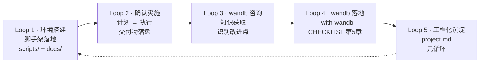

# 项目提示词 → Loop 工程档案

> 本文档是项目的**工程循环元文档**：把用户在开发过程中提出的全部提示词，
> 按 **Loop Engineering（循环工程）** 思想重构为可追溯、可递进的闭环记录。
>
> 分工定位：
> - `README.md` —— 回答"怎么用"（用法说明）
> - `docs/CHECKLIST.md` —— 回答"怎么查"（操作检查清单）
> - `project.md` —— 回答"怎么来的"（提示词 → 闭环的完整过程）

---

## 1. Loop Engineering 思想概览

### 1.1 从 Prompt 到 Loop：四层演进范式

AI 工程方法正从"人工触发的一次性问答"演进为"AI 自主运行的闭环"，
核心路径是四层递进：**Prompt → Context → Harness → Loop**。

| 层级 | 含义 | 本项目对应 |
|---|---|---|
| **Prompt**（提示词） | 单次人工指令，结果依赖一次性问答 | 本档案记录的 5 条用户提示词 |
| **Context**（上下文） | 为模型提供项目背景、契约与约束 | 项目结构、`run_grpo.py` CLI 契约、recipe 配置、`requirements.txt` 版本约束 |
| **Harness**（脚手架） | 把指令固化为可复用的工具链与自动化 | `scripts/`、`configs/`、`docs/CHECKLIST.md` |
| **Loop**（循环） | 感知→规划→执行→验证→反馈的自主闭环，可递进复用 | 本文档 `## 3` 中的 Loop 1~5 |

### 1.2 循环单元五段定义

每个 Loop 单元统一由五段闭环组成：

| 阶段 | 说明 |
|---|---|
| **Observe（感知）** | 读取项目现状、上下文事实与既有约束 |
| **Think（规划）** | 关键设计决策与取舍 |
| **Act（行动）** | 交付物路径 + 核心实现要点 |
| **Verify（验证）** | 验证方式与结果 |
| **Feedback（反馈）** | 闭环结论 + 指向下一循环的衔接线索 |

---

## 2. 项目循环架构（Harness）

### 2.1 触发源

用户在对话中对 AI 提出的提示词（本档案 Loop 1~5），
每一个提示词都是一个循环的**种子**，经过 Observe→Think→Act→Verify→Feedback
完整闭环后，转化为项目中的实际资产（脚本 / 文档 / 配置 / 决策）。

### 2.2 脚手架与交付物注册表

| 路径 | 职责 | 所属 Loop |
|---|---|---|
| `scripts/launch_train.sh` | GPU 自动检测、`num_processes = GPU数-1`、accelerate launch、recipe/mode 选择 | Loop 1 |
| `scripts/quick_test.sh` | 10 条极小数据集 × 5 步冒烟验证，逐行输出 loss/reward | Loop 1 |
| `scripts/setup_env.sh` | 一键环境安装（conda + 按 CUDA 装 torch + 可选 trl 源码 + `--with-wandb`） | Loop 1 / Loop 4 |
| `docs/CHECKLIST.md` | 硬件/软件/数据/训练前检查清单 + 常见问题排查表 + wandb 使用说明 | Loop 1 / Loop 4 |
| `scripts/run_grpo.py` | GRPO 训练主脚本（`--report_to wandb` / `--mode` 等 CLI 契约） | Loop 1（既有） |
| `configs/accelerate_configs/deepspeed_zero3.yaml` | ZeRO-3 启动配置（bf16 + CPU offload） | Loop 1（既有） |
| `recipes/*.yaml` | 全参数 / QLoRA 两套训练配方 | Loop 1（既有） |
| `requirements.txt` | 依赖清单（含被注释的可选 wandb） | Loop 1（既有） |

### 2.3 验证机制

| 机制 | 用途 |
|---|---|
| `bash -n <script>` | 脚本语法检查 |
| 与 `run_grpo.py` CLI 契约核对 | 参数名 / 覆盖逻辑一致（`--mode`/`--report_to`/`--max_steps` 等） |
| 行尾检查（LF） | 保证 Linux 集群可执行 |
| 交叉引用路径存在性核对 | 文档引用的每个文件真实存在 |

---

## 3. 提示词循环集合

### Loop 1：环境搭建交付循环（脚手架落地）

**触发 Prompt**（原文）：

> "请帮我编写项目启动脚本和运行检查清单。
> 1. 编写启动脚本 `scripts/launch_train.sh`，内容要求：自动检测可用 GPU 数量；根据 GPU 数量自动计算 num_processes（GPU数 - 1）；支持通过参数选择使用哪个 recipe 配置文件（默认 deepspeed_zero3）；支持通过参数选择全参数微调或 QLoRA 模式；包含完整的 accelerate launch 命令；添加错误检查（如 GPU 数量不足时给出提示）
> 2. 编写快速验证脚本 `scripts/quick_test.sh`：使用极小数据集（10条样本）；max_steps 设为 5；用于在正式训练前快速验证整个流程是否能跑通；输出每步的 loss 和 reward 值
> 3. 编写运行检查清单 `docs/CHECKLIST.md`，包含：硬件检查项（GPU 型号、显存、NVLink 状态）；软件环境检查项（各依赖版本、CUDA 版本、DeepSpeed 编译状态）；数据检查项（数据集完整性、格式正确性）；训练前检查项（配置文件参数合理性、模型加载测试）；常见问题排查表（ZeRO 显存不足、vLLM 推理超时、loss 发散、reward 异常等）
> 4. 编写一键环境安装脚本 `scripts/setup_env.sh`：创建 conda 环境；安装所有依赖（指定版本）；从源码安装 trl（如需 Liger GRPO Loss）；验证安装是否成功（打印各库版本）；配置 HuggingFace 镜像源（国内加速）"

- **Observe（感知）**：项目已有完整训练代码（`scripts/run_grpo.py`、`scripts/reward_functions.py`）、两套 recipe、`configs/accelerate_configs/deepspeed_zero3.yaml`；但缺少启动脚本、快速验证、检查清单与环境安装脚本；`requirements.txt` 给出了完整版本契约；无 `docs/` 目录。
- **Think（规划）**：核心决策——新脚本的**参数名与 `run_grpo.py` 的 CLI 契约严格对齐**；`num_processes = GPU数-1` 为训练预留 vLLM 卡；默认使用 `configs/accelerate_configs/deepspeed_zero3.yaml` 作为 accelerate 配置；`setup_env.sh` 遵循 `requirements.txt` 头部"先按 CUDA 版本装 torch 再装其余依赖"的顺序。
- **Act（行动）**：交付 `scripts/launch_train.sh`、`scripts/quick_test.sh`、`docs/CHECKLIST.md`、`scripts/setup_env.sh` 共 4 个文件；`setup_env.sh` 内置 `[1/5]~[5/5]` 五步安装流程与 `--source-trl` 可选开关。
- **Verify（验证）**：`bash -n` 语法检查全部通过；脚本参数（`--mode`/`--recipe`/`--report_to`/`--num-gpus`）与 `run_grpo.py` 实际支持项逐项核对一致；引用路径（`configs/`、`recipes/`、`data/`）均真实存在。
- **Feedback（反馈）**：脚手架闭环完成，形成可复用的 Harness；为后续快速验证（Loop 2 实施）与增强迭代（Loop 4）打下基础。

### Loop 2：确认实施循环（计划批准 → 执行）

**触发 Prompt**（原文）：

> "确认"

- **Observe（感知）**：Loop 1 的交付计划已生成并处于待批准状态；用户未提出修改意见。
- **Think（规划）**：无新增设计决策——批准即意味着按既有计划落地，重点在于保证 4 个交付物与现有契约的一致性。
- **Act（行动）**：无新增文件；该循环驱动 Loop 1 规划的 4 个交付物实际写入磁盘（计划 → 执行的"触发转换点"）。
- **Verify（验证）**：交付物全部落盘，路径与计划一致。
- **Feedback（反馈）**：闭环完成，项目进入可用状态；后续围绕日志可视化产生新需求（Loop 3）。

### Loop 3：wandb 咨询循环（知识获取 → 改进识别）

**触发 Prompt**（原文经会话压缩，按意图重建）：

> "wandb 的使用方法也告知一下。"

- **Observe（感知）**：项目契约中 `run_grpo.py` 已支持 `--report_to wandb`；`requirements.txt` 第 55 行 wandb 被注释（可选定位）；README 已提及 `--report_to` 参数，但缺完整使用说明。
- **Think（规划）**：先给出知识性解答（安装 / 登录 / 启用方式 / 离线模式），同时识别出两个**可落地改进点**：① `setup_env.sh` 增加 wandb 安装选项；② `docs/CHECKLIST.md` 补充使用说明章节。
- **Act（行动）**：知识性解答，无代码改动；产出建议清单并向用户提议落地。
- **Verify（验证）**：与 `run_grpo.py` 的 `--report_to wandb` 契约核对，确认 `GRPOConfig` 的 `wandb_project`/`wandb_entity` 可由 recipe 自动透传、无需改代码。
- **Feedback（反馈）**：识别出增强方向，征求用户确认 → 进入 Loop 4。

### Loop 4：wandb 落地循环（增强交付）

**触发 Prompt**（原文）：

> "需要"

- **Observe（感知）**：用户确认接受 Loop 3 提出的两项改进（`setup_env.sh` 加安装选项 + `CHECKLIST.md` 补说明）。
- **Think（规划）**：设计取舍——`--with-wandb` 采用**可选开关（默认不装）**，与 `requirements.txt` 中 wandb 被注释的可选定位一致；验证段**条件打印** wandb 版本（不并入通用版本列表，避免未安装时误报"导入失败"）；`CHECKLIST.md` 排查表章节编号顺延（5→6），改动面最小。
- **Act（行动）**：`scripts/setup_env.sh` 7 处改动（新增参数/安装块/验证段/结尾提示）；`docs/CHECKLIST.md` 3 处改动（新增 2.7 检查项、第 5 章 wandb 使用说明、排查表新增条目并顺延为第 6 章）。
- **Verify（验证）**：`bash -n` 语法检查通过；两文件均为 LF 行尾（CRLF 计数 0）；交叉引用核对无冲突（`launch_train.sh` 引用排查表不带章节号，不受顺延影响）。
- **Feedback（反馈）**：增强闭环完成；项目日志可视化能力从"仅 TensorBoard"升级为"TensorBoard + wandb 可选"；本次请求自然引出工程化沉淀需求（Loop 5）。

### Loop 5：工程化沉淀循环（本档案）

**触发 Prompt**（原文）：

> "将我在这个项目的所有提示词集合按照loop engineering思想的方式转换到project.md中，放在根目录下。"

- **Observe（感知）**：项目内不存在任何既有的 prompt/loop 相关文件；确认"提示词集合"即本会话中用户向 AI 提出的全部 5 条指令；已通过检索确认 **Loop Engineering** 定义（Prompt → Context → Harness → Loop 四层范式，Observe→Think→Act→Verify→Feedback 闭环单元）。
- **Think（规划）**：采用 Loop Engineering 五段闭环结构组织每条提示词；每条 Loop 的 Act 字段**交叉引用项目真实路径**，保证可追溯性；会话压缩导致的缺失原文按意图重建并明确标注，不虚构细节。
- **Act（行动）**：交付 `project.md`（即本文件），包含概览、循环架构、5 个 Loop 单元、闭环演进图谱、循环使用指南。
- **Verify（验证）**：逐一核对文档引用的文件路径真实存在；Markdown 结构完整性检查（标题层级、5 个 Loop 单元六字段齐全、代码块/mermaid 块闭合、表格格式正确）；5 条提示词覆盖与相对历史清单逐一比对无遗漏。
- **Feedback（反馈）**：本循环自身构成一个**元循环**（"关于循环的循环"）——它把此前 4 个循环的沉淀固化为文档资产，使整个项目的演进过程可复盘、可复用；后续新提示词按 `## 5` 的登记模板继续进入循环。

### Loop 6：Megatron-LM 链路集成（平行方案扩展）

**触发 Prompt**（原文）：

> "加上megatron-lm的多卡分布式训练方法"

> 澄清补充：用户随后确认交付范围为「**文档 + 脚本 + 环境集成**」、场景覆盖「**预训练 + SFT + GRPO（增加 veRL）**」、且**需要**「模型权重与数据格式的双向转换说明」。

- **Observe（感知）**：项目已有成熟的 TRL + DeepSpeed(ZeRO-3) GRPO 链路；全库检索 `megatron` / `tensor-model-parallel` 等关键词 **0 处匹配**，需从零新增；联网核实 Megatron Core 官方安装方式（PyPI / extras / 源码 / NGC 容器）、mbridge 双向转换 API、veRL Megatron 后端的 5D 并行与 offload 参数。识别出关键**版本冲突**：Megatron Core 要求 `torch>=2.6.0`，而主 `requirements.txt` 为 `torch>=2.5.0`。
- **Think（规划）**：采用"**平行新增、物理隔离、契约对齐**"策略——Megatron 全部资产集中在 `scripts/megatron/` 与 `configs/megatron/`，依赖独立为 `requirements-megatron.txt`，**不改动任何既有训练脚本**；脚本风格复用项目既有约定（`set -euo pipefail` + 彩色日志 + 头部注释块 + LF 行尾 + `bash -n` 验证）。针对 Qwen2.5-3B 的 `num_query_groups=2`，识别出 **TP 上限为 2**，并写成脚本前置校验项，避免用户排进集群后才发现配置非法。
- **Act（行动）**：新增 `requirements-megatron.txt`、`scripts/megatron/{convert_checkpoint.py, prepare_sft_data.py, pretrain_qwen.sh, sft_qwen.sh, grpo_verl_megatron.sh}`、`configs/megatron/{pretrain_qwen2.5-3b.env, sft_qwen2.5-3b.env, README.md}`；`setup_env.sh` 新增 `--with-megatron` / `--megatron-lite` / `--max-jobs` 及验证段打印；`README.md` 新增完整章节；`docs/CHECKLIST.md` 补充检查项与排查条目。
- **Verify（验证）**：全部 `.sh` 通过 `bash -n` 语法检查；两个 Python 脚本通过 `py_compile`；行尾统一为 LF；引用的路径与配置键交叉核对无冲突。
- **Feedback（反馈）**：形成与 TRL 主链路并行的第二条训练路径，三条子链路（预训练/SFT/GRPO）全部覆盖；因 veRL / Megatron 参数键随版本演进较快，脚本已在头部注明"以安装版本为准"并提供 `--dry-run` 预检；后续可在真实 GPU 集群上验证并回填实际吞吐数据。

---

## 4. 闭环演进图谱



演进主线：**搭建（Harness）→ 验证（闭环确认）→ 增强（wandb）→ 沉淀（文档化）**，
每一轮循环都以既有交付物为 Context，闭环反馈为下一轮提供输入。

---

## 5. 循环使用指南

### 5.1 阅读方法

- **新成员/复盘**：按 `## 3` 顺序阅读 5 个 Loop，理解每个交付物"为什么这样做"（Observe/Think），而不只是"是什么"（对应 README）。
- **排障**：结合 `## 2.3 验证机制` 与 `docs/CHECKLIST.md` 排查表使用。
- **找交付物**：通过 `## 2.2 交付物注册表` 快速定位文件与所属循环。

### 5.2 新增提示词登记模板

新的开发需求提出后，按以下模板登记为一个新的 Loop（`## 3` 末尾追加，编号顺延）：

```markdown
### Loop N：<标题>（<类型>）

**触发 Prompt**（原文）：
> <提示词原文>

- **Observe（感知）**：<现状事实与约束>
- **Think（规划）**：<关键决策与取舍>
- **Act（行动）**：<交付物路径 + 要点>
- **Verify（验证）**：<验证方式与结果>
- **Feedback（反馈）**：<闭环结论 + 下一循环衔接>
```

### 5.3 文档分工

| 文档 | 回答的问题 | 维护时机 |
|---|---|---|
| `README.md` | 怎么用（安装/训练/调参） | 用法变化时 |
| `docs/CHECKLIST.md` | 怎么查（检查项/排查表） | 检查项或已知问题变化时 |
| `project.md` | 怎么来的（提示词 → 闭环） | 每个需求闭环后 |
